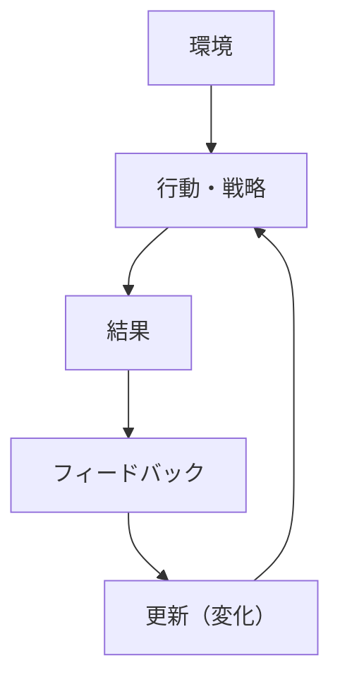
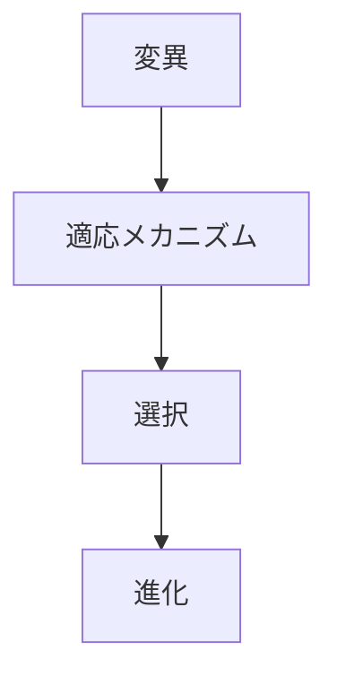

# 適応メカニズム

## 定義

主体（個人・組織・制度・生物）が

- 環境
- 条件
- 制約
- フィードバック

に応じて、**行動・戦略・構造を変化させ、環境への適合度を高めていく仕組み**を  
**適応メカニズム**という。

---

# 基本構造



つまり

```text
環境
↓
行動
↓
結果
↓
フィードバック
↓
更新
```

というループである。

---

# 適応の本質

## 1 フィードバックに基づく変化

適応は

```
結果に応じて変える
```

プロセスである。

---

## 2 最適ではなく改善

適応は

```
完全最適
```

ではなく、

```
より良くする方向への変化
```

である。

---

## 3 継続的プロセス

環境が変わる限り

```
適応は終わらない
```

---

# 適応が起こる条件

## 1 環境変化

環境が変わらなければ適応は不要。

---

## 2 フィードバックの存在

結果が観察できる必要がある。

---

## 3 更新可能性

行動や戦略を変えられる必要がある。

---

## 4 選択圧

適応しないと不利になる。

---

# kernelとの関係



---

# 変異との関係

変化の素材が必要。

---

# 選択との関係

適応の結果は

```
選択
```

によって評価される。

---

# 進化との関係

適応の積み重ねが

```
進化
```

を生む。

---

# 学習との関係

個体レベルでは適応は

```
学習
```

として現れる。

---

# インセンティブとの関係

環境の報酬構造が

```
適応方向
```

を決める。

---

# 適応のタイプ

## 行動適応

行動の変化。

---

## 戦略適応

意思決定ルールの変更。

---

## 構造適応

組織や制度の変化。

---

## 文化適応

価値観や規範の変化。

---

# 適応の失敗

## 誤学習

誤ったフィードバック。

---

## 遅延

環境変化に追いつかない。

---

## ロックイン

過去の成功に固執。

---

## 局所最適

全体最適に至らない。

---

# 各領域での例

## 生物

- 進化適応
- 生存戦略

---

## 個人

- 学習
- 習慣変化

---

## 組織

- 戦略変更
- 組織改革

---

## 社会

- 制度変化
- 文化変容

---

## 技術

- アルゴリズム改善
- システム最適化

---

# pattern

適応メカニズムから現れるパターン

- フィードバックループ
- 試行錯誤
- 局所最適
- ロックイン

---

# case

- 企業の戦略転換
- 個人のスキル習得
- 生物の進化
- 政策変更

---

# 見分けるための問い

- 環境は何か
- 何がフィードバックとして返ってきているか
- どの部分が更新されているか
- 適応は速いか遅いか
- 適応方向は正しいか

---

# 要約

適応メカニズムとは

**環境とフィードバックに応じて行動・戦略・構造を変化させ、適合度を高めていく仕組み**

であり、

```text
環境
↓
行動
↓
結果
↓
フィードバック
↓
更新
```

というループを通じて  
個人・組織・社会の変化と存続を支える。