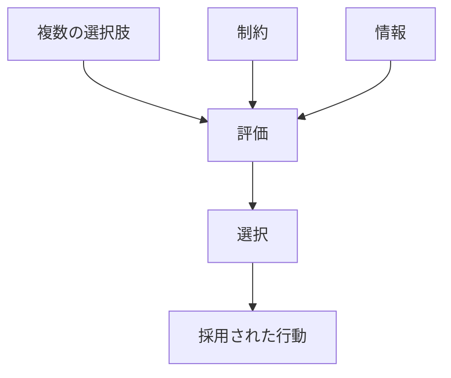
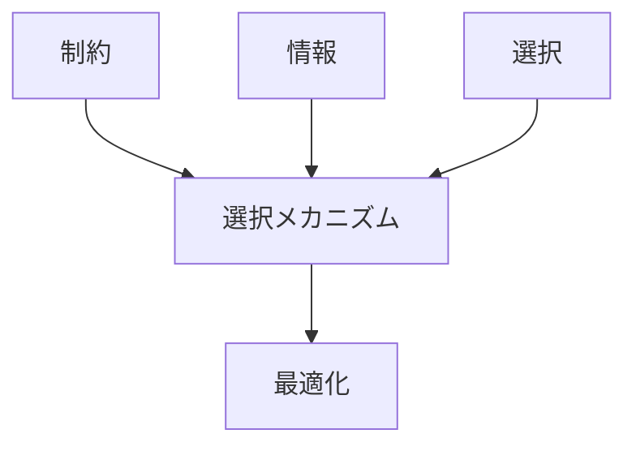

# 選択メカニズム

## 定義

複数の選択肢の中から、

- どれを採用するか
- どれを捨てるか
- 何を優先するか

を決める仕組みを **選択メカニズム** という。

これは単なる結果ではなく、  
**情報・評価・制約・期待にもとづいて選択肢が絞り込まれる過程** である。

---

# 基本構造



つまり

```text
選択肢
+
制約
+
情報
↓
評価
↓
選択
↓
行動
```

である。

---

# 選択メカニズムの本質

## 1 選択肢があるから選択が起こる

選択メカニズムは、少なくとも二つ以上の可能性があるときに作動する。

例

- 買う / 買わない
- 採用する / 採用しない
- 攻める / 守る
- A案 / B案 / C案

---

## 2 制約が選択を絞る

現実の選択は自由ではなく、

- 予算
- 時間
- 能力
- 権限
- ルール

によって制限される。

したがって選択とは  
**制約下での絞り込み** である。

---

## 3 評価基準が必要

選択には

- 利益
- 安全性
- 速さ
- 正しさ
- 一貫性

などの評価軸が必要である。

評価軸が違えば、同じ選択肢でも選ばれる結果は変わる。

---

## 4 捨てることも含む

選択は「選ぶこと」だけでなく  
**他を捨てること** でもある。

そのため選択には常に

- 機会費用
- トレードオフ
- 後悔可能性

が伴う。

---

# kernelとの関係



---

# 選択との関係

[[02_zettelkasten/01_knowledge/world_model/concept/選択]] は普遍原理であり、  
選択メカニズムはその具体的作動形である。

```text
選択（原理）
↓
選択メカニズム（実際の判断過程）
```

---

# 制約との関係

制約がなければ、選択は意味を持たない。

選択メカニズムは常に

```text
何ができないか
```

を前提に動く。

---

# 情報との関係

選択は情報なしではできない。

ただし現実には完全情報はないため、  
選択メカニズムは不完全情報下で作動する。

---

# 限定合理性との関係

現実の主体は

- 全選択肢を調べられない
- 全結果を計算できない
- 時間が足りない

ため、選択メカニズムはしばしば  
[[02_zettelkasten/01_knowledge/world_model/mechanism/decision/限定合理性メカニズム]] と結びつく。

---

# 信念更新との関係

新しい情報によって信念が変わると、  
評価基準や期待結果が変わり、選択も変わる。

---

# インセンティブとの関係

報酬や罰が違えば、同じ主体でも別の選択をする。

したがって選択メカニズムは  
[[02_zettelkasten/01_knowledge/world_model/mechanism/incentive/インセンティブメカニズム]] に強く依存する。

---

# 選択メカニズムの主要類型

## 比較選択

複数案を並べて比較する。

例  
見積比較、候補比較。

---

## 閾値選択

一定基準を超えたものだけ採る。

例  
採用基準、合格点。

---

## 満足化選択

最適ではなく「十分よい」案を選ぶ。

例  
時間がない中での意思決定。

---

## 逐次選択

一つずつ見て、その都度採否を決める。

例  
応募者面接、営業リスト。

---

## 制度選択

個人ではなく制度やルールが選ぶ。

例  
試験制度、価格メカニズム。

---

# 各領域での例

## 個人

- 商品選択
- 進路選択
- 旅行ルート選択

---

## 組織

- 人材採用
- 投資案件採択
- 予算配分

---

## 市場

- 消費者選好
- 企業の戦略採択
- 価格競争での勝者選択

---

## 生物

- 配偶者選択
- 生存戦略選択

---

## 政治・制度

- 候補者選択
- 政策選択
- 制度採択

---

# pattern

選択メカニズムから現れやすいパターン

- 優先順位固定
- 勝者総取り
- 局所最適
- 選択の偏り
- 慣性選択
- 保守的選択

---

# case

- 採用面接
- 商品購入
- 投資判断
- プロジェクト採否
- 配偶者選択

---

# 見分けるための問い

- 選択肢は何か
- 誰が選んでいるか
- どの評価基準で比べているか
- 制約は何か
- 捨てられた選択肢は何か
- 最適化か、満足化か、惰性か

---

# 要約

選択メカニズムとは

**複数の選択肢の中から、情報・制約・評価にもとづいて、どれを採用しどれを捨てるかを決める仕組み**

であり、

```text
選択肢
+
制約
+
情報
↓
評価
↓
選択
↓
行動
```

という過程を通じて  
個人、組織、市場、生物の行動分岐を生み出す。