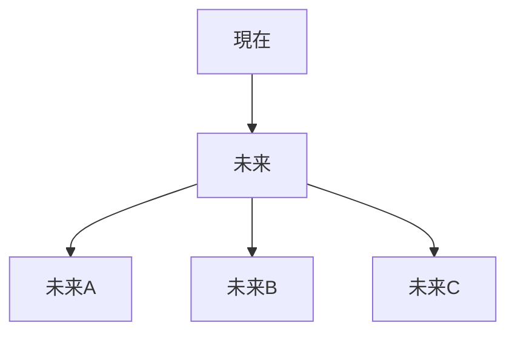

---

# 不確実性制約

```markdown
---
note_type: kernel
layer: kernel
kernel_type: constraint
related:
  - [[情報制約]]
---

# 不確実性制約（Uncertainty Constraint）

未来は完全には予測できないという制約。

---

# 構造



---

# 結果

- リスク    
- 保険    
- 分散