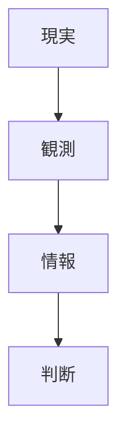

---

# 情報制約

```markdown
---
note_type: kernel
layer: kernel
kernel_type: constraint
related:
  - [[不確実性制約]]
  - [[認知制約]]
---

# 情報制約（Information Constraint）

主体は、完全な情報を持たないという制約を持つ。

---

# 構造



---

# 結果

- 不完全情報    
- 誤判断    
- 情報探索