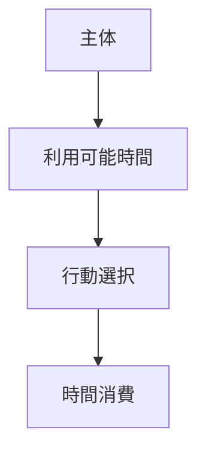

# 時間制約（Time Constraint）

時間制約とは、

**主体が利用できる時間は有限である**

という普遍的制約である。

すべての行動は時間を消費するため、
主体は時間の配分を決定する必要がある。

---

# 基本構造

```mermaid
flowchart TD
A[主体]
A --> B[利用可能時間]
B --> C[行動選択]
C --> D[時間消費]
```

---

# 結果

時間制約は次を生む。
- 優先順位    
- 機会費用    
- 締切    
- スケジュール