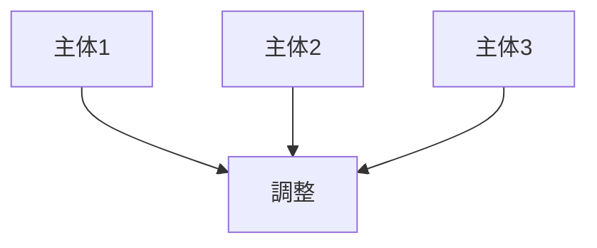

---

# 調整制約

```markdown
---
note_type: kernel
layer: kernel
kernel_type: constraint
---

# 調整制約（Coordination Constraint）

複数主体の行動を

**一致させることは困難**

という制約。

---

# 構造



---

# 結果

- 組織    
- ルール    
- 制度