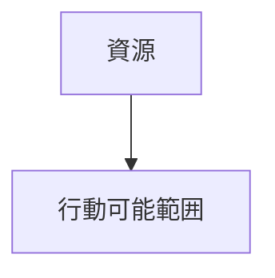

---

# 資源制約

```markdown
---
note_type: kernel
layer: kernel
kernel_type: constraint
related:
  - [[エネルギー制約]]
---

# 資源制約（Resource Constraint）

主体が利用できる物質・資本・労働は有限という制約。

---

# 構造



---

# 結果

- 選択    
- 配分    
- 希少性