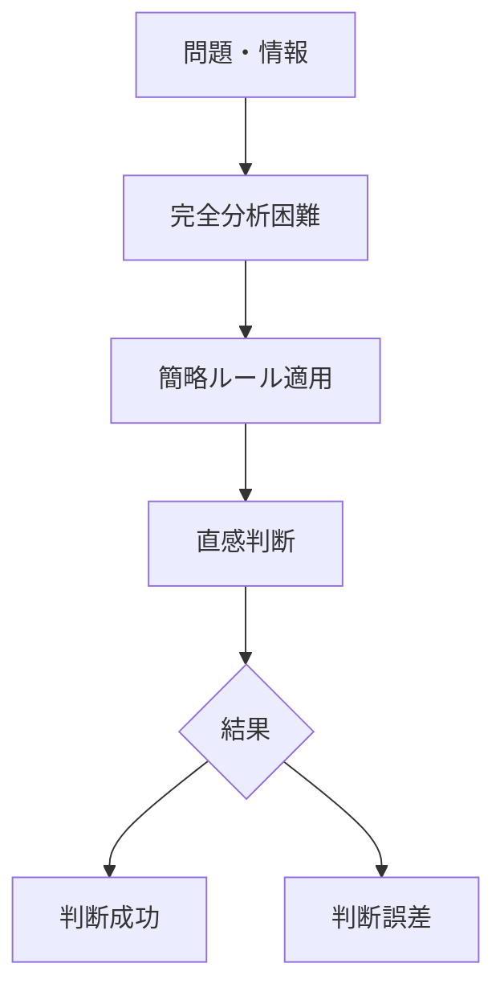

# ヒューリスティック判断パターン

人間は複雑な問題を判断する際、  
完全な分析ではなく簡便なルール（ヒューリスティック）を用いる。

この簡略化された判断方法により意思決定は高速化されるが、  
同時に体系的な判断誤差が生じる。

この現象を **ヒューリスティック判断パターン** と呼ぶ。

---

# パターン構造

---

# 説明

人間の認知資源は有限であるため、

- 情報処理
- 計算
- 分析

をすべて行うことは難しい。

そのため脳は

**簡略化された判断ルール**

を用いる。

これにより

- 判断速度が上がる
- 認知負荷が下がる

が、同時に **認知バイアス**が生まれる。

---

# 典型的ヒューリスティック

## アンカリング

最初の情報に引きずられる。

## 利用可能性

思い出しやすい情報を重視する。

## 代表性

典型例に似ているかで判断する。

---

# 社会での例

日常判断

- 直感的意思決定

投資

- 短期情報への依存

医療

- 診断の経験則

政治

- 印象による判断

---

# 特徴

ヒューリスティックは

- 判断速度を上げる
- 認知負荷を下げる
- 判断誤差を生む

という性質を持つ。

---

# 関連

Structure  
[[認知バイアス構造]]

Kernel  

[[02_zettelkasten/01_knowledge/world_model/meta/model/human/congnition/限定合理性]]  
[[認知節約原理]]

関連Pattern  

[[02_zettelkasten/01_knowledge/world_model/meta/pattern/cognition/アンカリングパターン]]  
[[02_zettelkasten/01_knowledge/world_model/meta/pattern/cognition/利用可能性ヒューリスティックパターン]]  
[[02_zettelkasten/01_knowledge/world_model/meta/pattern/cognition/フレーミングパターン]]

Case  

[[直感判断]]  
[[意思決定バイアス]]