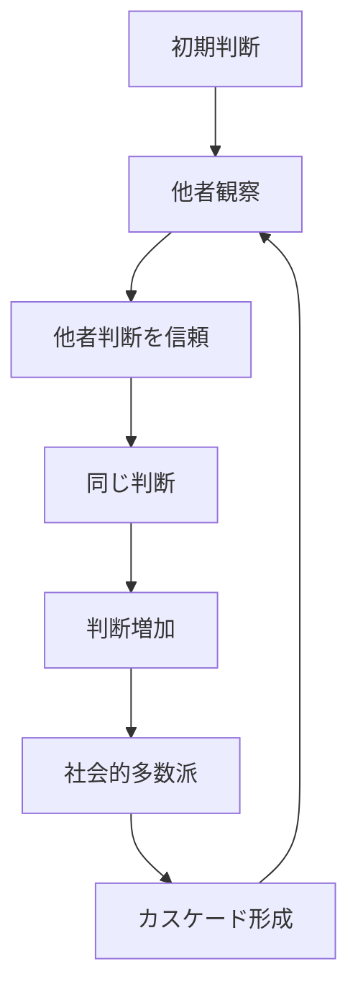

# 情報カスケードパターン

人間は、他者の行動や判断を観察すると、
自分の情報よりもそれを信頼して同じ判断をすることがある。

この結果、ある判断や行動が連鎖的に広がり、
多数の人が同じ行動を取る現象が発生する。

この現象を **情報カスケードパターン** と呼ぶ。

---

# パターン構造



---

# 説明

人間は意思決定の際、

- 情報不足
- 判断コスト
- 社会的リスク

を避けるため、

**他人の判断を参考にする。**

しかし多くの人が同じ行動を取ると

```
他人がやっている
↓
正しいと判断
↓
同じ行動
```

という連鎖が発生する。

---

# 典型的パターン

## 流行

例

- 人気商品
- ファッション

---

## 投資

例

- バブル
- 株式投機

---

## SNS

例

- 炎上
- トレンド拡散

---

# 社会での例

市場

- チューリップバブル
- 仮想通貨バブル

政治

- 世論形成
- 集団運動

情報

- デマ拡散
- SNS拡散

---

# 特徴

情報カスケードは

- 初期情報が重要
- 小さな行動が拡大する
- 誤情報でも成立する

という性質を持つ。

---

# 関連

Structure  
[[社会的影響構造]]

Kernel  

[[02_zettelkasten/01_knowledge/world_model/meta/model/human/congnition/限定合理性]]  
[[02_zettelkasten/01_knowledge/world_model/meta/model/human/社会性原理]]  
[[02_zettelkasten/01_knowledge/world_model/meta/model/human/模倣原理]]

関連Pattern  

[[02_zettelkasten/01_knowledge/world_model/meta/pattern/cognition/社会的同調パターン]]  
[[02_zettelkasten/01_knowledge/world_model/meta/pattern/cognition/パニックパターン]]  
[[02_zettelkasten/01_knowledge/world_model/meta/pattern/cognition/確証バイアスパターン]]

Case  

[[SNS炎上]]  
[[投資バブル]]