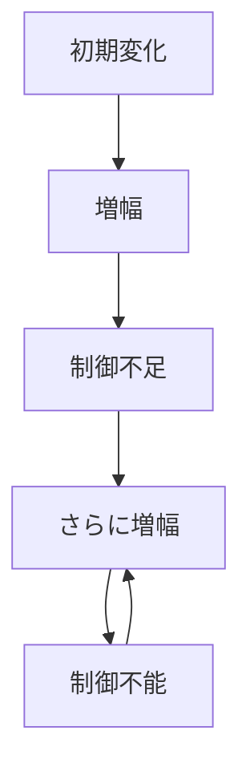

# 暴走パターン

正のフィードバックが制御を上回り、変化が自己強化され続けて制御不能になるダイナミクスを **暴走パターン** と呼ぶ。

---

# パターン構造

---

# 説明

暴走は、増幅それ自体よりも「抑制機構が効かない」ことが本質である。

そのため暴走では

- 負のフィードバックが弱い
- 制御のタイミングが遅い
- 参加者が増幅に巻き込まれる

という条件が重なる。

---

# 典型的局面

## 初期変化

小さなズレが発生する。

## 増幅

変化が自己強化される。

## 抑制失敗

制御が追いつかない。

## 暴走

変化そのものが自律的に拡大する。

---

# 社会での例

- ハイパーインフレ
- 群衆暴走
- 組織の過剰ノルマ競争
- 軍拡競争

---

# 特徴

暴走は

- バブルより制御喪失の度合いが高い
- 崩壊や連鎖崩壊の前段階になりやすい
- 制度的ブレーキの不在を示す

---

# 関連

Structure  
[[増幅構造]]

Pattern  
[[02_zettelkasten/01_knowledge/world_model/pattern/dynamics/mechanism/増幅パターン]]  
[[02_zettelkasten/01_knowledge/world_model/pattern/dynamics/mechanism/フィードバックパターン]]  
[[02_zettelkasten/01_knowledge/world_model/pattern/cognition/パニックパターン]]  
[[02_zettelkasten/01_knowledge/world_model/pattern/dynamics/mechanism/崩壊パターン]]

Case  
[[ハイパーインフレ]]