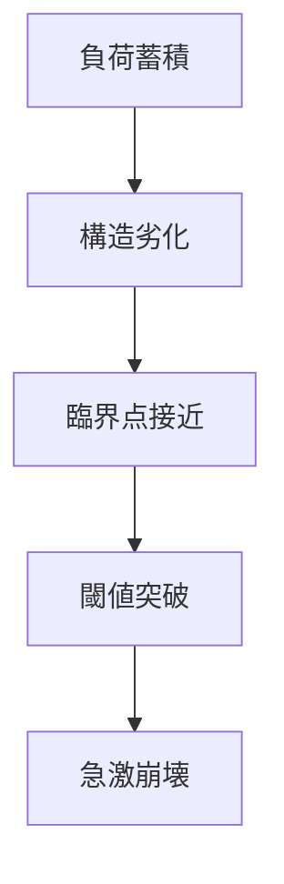

# 臨界崩壊パターン

システム内部に負荷や劣化が蓄積し、ある臨界点を超えた瞬間に全体機能が急激に失われるダイナミクスを **臨界崩壊パターン** と呼ぶ。

---

# パターン構造

---

# 説明

臨界崩壊では、崩壊は突然見えるが、実際には長期の蓄積が前提となっている。

つまり

- 表面は安定
- 内部は劣化
- 一点突破で崩壊

という構図になる。

---

# 典型的局面

## 蓄積

負荷や歪みが溜まる。

## 劣化

耐久力が下がる。

## 接近

わずかな追加負荷で危険になる。

## 崩壊

機能が急速に喪失する。

---

# 社会での例

- 金融機関の破綻
- インフラ事故
- 国家財政破綻
- 生態系の急崩壊

---

# 特徴

臨界崩壊は

- 前兆が過小評価されやすい
- 正常性バイアスと相性が悪い
- 崩壊後の回復が難しいことが多い

---

# 関連

Structure  
[[崩壊構造]]

Pattern  
[[02_zettelkasten/01_knowledge/world_model/pattern/dynamics/mechanism/臨界点パターン]]  
[[02_zettelkasten/01_knowledge/world_model/pattern/dynamics/mechanism/崩壊パターン]]  
[[02_zettelkasten/01_knowledge/world_model/pattern/cognition/正常性バイアスパターン]]

Case  
[[金融破綻]]