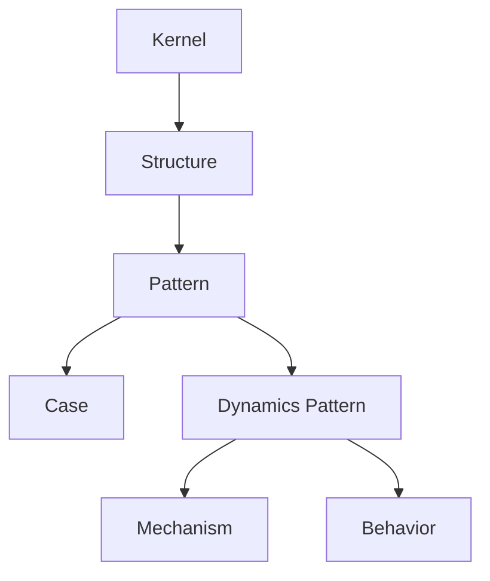
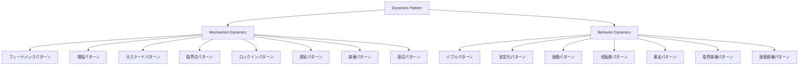
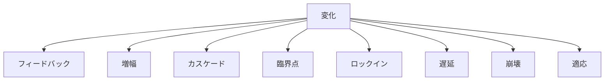
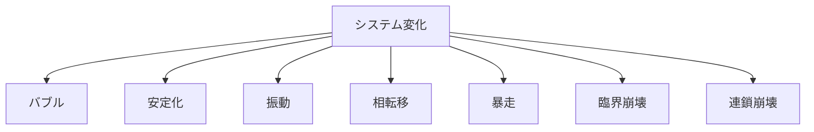
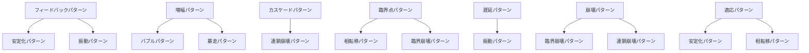
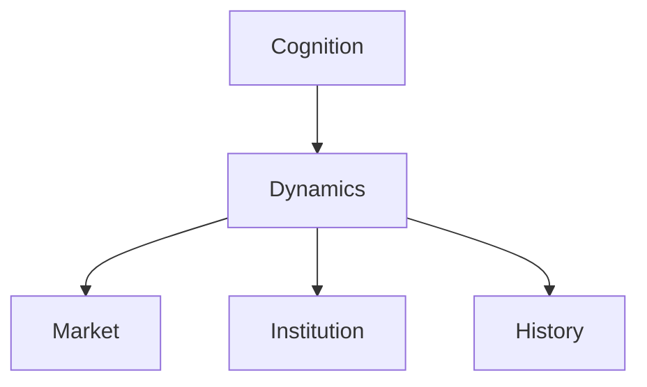

# Dynamics Pattern Hub

Dynamics Pattern は、要素・集団・制度・市場・社会システムが  
**時間の中でどのように変化し、連鎖し、増幅し、崩壊し、再均衡するか**  
を扱う Pattern 群である。

Dynamics は静的な構造ではなく、構造が時間の中で示す典型的な運動様式を整理する層である。

---

# 位置づけ

---

# 全体構造

---

# 1. Mechanism Dynamics

Mechanism Dynamics は、  
**なぜその変化が起きるのか**  
を説明するダイナミクスである。

---

## ノート一覧

- [[02_zettelkasten/01_knowledge/world_model/meta/pattern/dynamics/mechanism/フィードバックパターン]]
- [[02_zettelkasten/01_knowledge/world_model/meta/pattern/dynamics/mechanism/増幅パターン]]
- [[02_zettelkasten/01_knowledge/world_model/meta/pattern/dynamics/mechanism/カスケードパターン]]
- [[02_zettelkasten/01_knowledge/world_model/meta/pattern/dynamics/mechanism/臨界点パターン]]
- [[02_zettelkasten/01_knowledge/world_model/meta/pattern/dynamics/mechanism/ロックインパターン]]
- [[02_zettelkasten/01_knowledge/world_model/meta/pattern/dynamics/mechanism/遅延パターン]]
- [[02_zettelkasten/01_knowledge/world_model/meta/pattern/dynamics/mechanism/崩壊パターン]]
- [[02_zettelkasten/01_knowledge/world_model/meta/pattern/dynamics/mechanism/適応パターン]]

---

## 説明

この群は、変化を生み出すメカニズムを扱う。

たとえば

- 変化が自分自身を強めるのか
- 変化が抑制されるのか
- 変化が連鎖するのか
- 閾値を超えて急変するのか
- 初期選択が固定化するのか
- 原因と結果の間に遅れがあるのか
- システムが壊れるのか
- それとも調整して生き残るのか

を整理する。

---

## 基本マップ

---

# 2. Behavior Dynamics

Behavior Dynamics は、  
**システムが実際にどのような振る舞いとして現れるか**  
を整理するダイナミクスである。

---

## ノート一覧

- [[02_zettelkasten/01_knowledge/world_model/meta/pattern/dynamics/behavior/バブルパターン]]
- [[02_zettelkasten/01_knowledge/world_model/meta/pattern/dynamics/behavior/安定化パターン]]
- [[02_zettelkasten/01_knowledge/world_model/meta/pattern/dynamics/behavior/振動パターン]]
- [[02_zettelkasten/01_knowledge/world_model/meta/pattern/dynamics/behavior/相転移パターン]]
- [[02_zettelkasten/01_knowledge/world_model/meta/pattern/dynamics/behavior/暴走パターン]]
- [[02_zettelkasten/01_knowledge/world_model/meta/pattern/dynamics/behavior/臨界崩壊パターン]]
- [[02_zettelkasten/01_knowledge/world_model/meta/pattern/dynamics/behavior/連鎖崩壊パターン]]

---

## 説明

この群は、メカニズムの結果として現れる運動様式を扱う。

たとえば

- 過熱して膨張する
- 均衡へ戻る
- 上下動する
- 急に別の状態へ移る
- 制御不能に拡大する
- 閾値を超えて崩れる
- 一箇所の故障が全体へ広がる

といった振る舞いを説明する。

---

## 基本マップ

---

# Mechanism と Behavior の対応

---

# 典型的な読み方

## 最小ルート

1. [[02_zettelkasten/01_knowledge/world_model/meta/pattern/dynamics/mechanism/フィードバックパターン]]
2. [[02_zettelkasten/01_knowledge/world_model/meta/pattern/dynamics/mechanism/増幅パターン]]
3. [[02_zettelkasten/01_knowledge/world_model/meta/pattern/dynamics/mechanism/カスケードパターン]]
4. [[02_zettelkasten/01_knowledge/world_model/meta/pattern/dynamics/mechanism/臨界点パターン]]
5. [[02_zettelkasten/01_knowledge/world_model/meta/pattern/dynamics/mechanism/崩壊パターン]]

これは Dynamics の最小骨格である。

---

## 市場ルート

1. [[02_zettelkasten/01_knowledge/world_model/meta/pattern/dynamics/mechanism/フィードバックパターン]]
2. [[02_zettelkasten/01_knowledge/world_model/meta/pattern/dynamics/mechanism/増幅パターン]]
3. [[02_zettelkasten/01_knowledge/world_model/meta/pattern/dynamics/behavior/バブルパターン]]
4. [[02_zettelkasten/01_knowledge/world_model/meta/pattern/dynamics/behavior/安定化パターン]]
5. [[02_zettelkasten/01_knowledge/world_model/meta/pattern/dynamics/mechanism/ロックインパターン]]

市場・価格・競争・規格固定を読むためのルート。

---

## 危機ルート

1. [[02_zettelkasten/01_knowledge/world_model/meta/pattern/dynamics/mechanism/遅延パターン]]
2. [[02_zettelkasten/01_knowledge/world_model/meta/pattern/dynamics/mechanism/臨界点パターン]]
3. [[02_zettelkasten/01_knowledge/world_model/meta/pattern/dynamics/behavior/臨界崩壊パターン]]
4. [[02_zettelkasten/01_knowledge/world_model/meta/pattern/dynamics/behavior/連鎖崩壊パターン]]

危機・事故・金融破綻・国家崩壊を読むためのルート。

---

## 社会変動ルート

1. [[02_zettelkasten/01_knowledge/world_model/meta/pattern/dynamics/mechanism/増幅パターン]]
2. [[02_zettelkasten/01_knowledge/world_model/meta/pattern/dynamics/behavior/相転移パターン]]
3. [[02_zettelkasten/01_knowledge/world_model/meta/pattern/dynamics/behavior/暴走パターン]]
4. [[02_zettelkasten/01_knowledge/world_model/meta/pattern/dynamics/mechanism/適応パターン]]

社会変動・制度転換・群衆運動を読むためのルート。

---

# 関連する Structure

- [[因果ループ構造]]
- [[連鎖構造]]
- [[閾値構造]]
- [[自己強化構造]]
- [[時間遅延構造]]
- [[崩壊構造]]
- [[適応構造]]
- [[均衡構造]]
- [[増幅構造]]

---

# 関連する Pattern

## Cognition 側

- [[02_zettelkasten/01_knowledge/world_model/pattern/cognition/情報カスケードパターン]]
- [[02_zettelkasten/01_knowledge/world_model/pattern/cognition/パニックパターン]]
- [[02_zettelkasten/01_knowledge/world_model/pattern/cognition/過信パターン]]
- [[02_zettelkasten/01_knowledge/world_model/pattern/cognition/正常性バイアスパターン]]
- [[02_zettelkasten/01_knowledge/world_model/pattern/cognition/フレーミングパターン]]

## Social / Institution 側

- [[02_zettelkasten/01_knowledge/world_model/pattern/cognition/社会的同調パターン]]
- [[02_zettelkasten/01_knowledge/world_model/pattern/organization/pattern/behavior/官僚化パターン]]
- [[02_zettelkasten/01_knowledge/world_model/meta/pattern/organization/pattern/power/権力集中パターン]]
- [[02_zettelkasten/01_knowledge/world_model/pattern/market/pattern/寡占形成パターン]]

---

# Dynamics の意味

Dynamics は  
「何があるか」ではなく  
**「それがどう動くか」**  
を扱う。

したがって

- Structure = 配置や関係
- Pattern = 典型的運動
- Dynamics = 時間展開の型

として読むと整理しやすい。

---

# 次の接続先

Dynamics の次に進む先として自然なのは以下である。

## Market

- 競争
- 参入
- 寡占
- 価格形成
- 差別化
- ネットワーク効果
- 市場ロックイン
- バブルと崩壊

## Institution

- 制度硬直化
- 官僚化
- 統治
- 正統性
- 制度変化

## History

- 長期循環
- 体制転換
- 戦争拡大
- 崩壊と再編

---

# メモ

Dynamics は単独でも使えるが、  
本来は

のように、他の領域の「時間展開」を読むための共通エンジンとして使う。

---