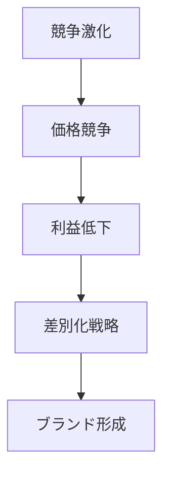

# 差別化パターン

企業が価格競争を避けるために、製品・サービス・ブランドなどで独自性を作り出す市場パターン。

---

# パターン構造

---

# 説明

差別化は、企業が単なる価格競争から脱出するための基本戦略である。

差別化には

- 技術
- ブランド
- デザイン
- サービス
- ストーリー

などが使われる。

---

# 例

- Apple
- Nike
- Starbucks

---

# 関連

Structure  
[[02_zettelkasten/01_knowledge/world_model/meta/pattern/market/dynamics/競争構造]]

Cognition  
[[02_zettelkasten/01_knowledge/world_model/pattern/cognition/フレーミングパターン]]

Pattern  
[[02_zettelkasten/01_knowledge/world_model/meta/pattern/market/pattern/価格戦争パターン]]