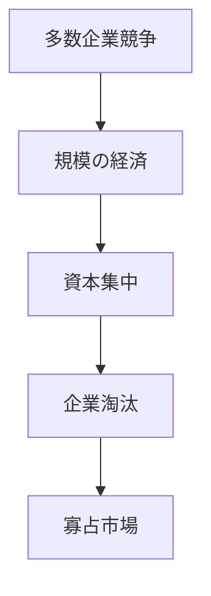

# 寡占形成パターン

市場では競争の結果、少数の企業が支配的地位を獲得する傾向がある。

---

# パターン構造

---

# 典型的メカニズム

- 規模の経済
- ブランド力
- 技術優位
- 資本力
- ネットワーク効果

---

# 典型事例

- GAFA
- 日本の携帯キャリア
- 石油メジャー

---

# 関連

Structure  
[[02_zettelkasten/未整理/model 1/world_model/03_social/competition/寡占構造]]

Kernel  
[[02_zettelkasten/01_knowledge/world_model/meta/kernel/social/競争原理]]

Case  
[[GAFA市場支配]]