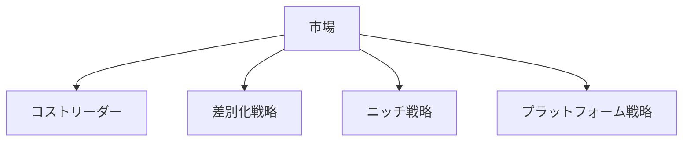
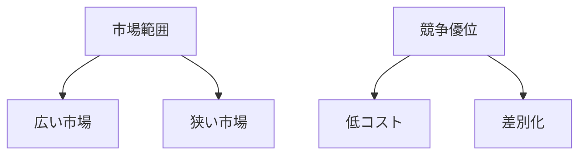
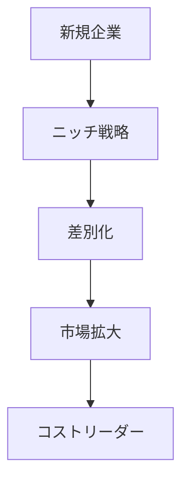

# 市場ポジション構造

市場ポジション構造とは、企業が市場の中でどのような位置を占め、どのような価値提供によって競争優位を築くかを整理する構造である。

市場における企業のポジションは主に

- コスト
- 差別化
- 市場範囲
- ネットワーク

などによって決まる。

---

# 基本構造

---

# 1 コストリーダー

低コストで製品・サービスを提供することで競争優位を築くポジション。

特徴

- 規模の経済
- 効率化
- 価格競争力

例

- Walmart
- IKEA
- ユニクロ

---

# 2 差別化戦略

独自の価値を提供することで価格競争を避けるポジション。

差別化要素

- 技術
- ブランド
- デザイン
- サービス
- 体験

例

- Apple
- Nike
- Tesla

---

# 3 ニッチ戦略

特定の顧客層・用途・地域などに特化するポジション。

特徴

- 小規模市場
- 高い専門性
- 顧客密着

例

- 高級時計
- 特殊工具
- 専門ソフト

---

# 4 プラットフォーム戦略

市場の取引基盤を提供することで価値を生み出すポジション。

特徴

- ネットワーク効果
- エコシステム形成
- 多面市場

例

- Google
- Amazon
- Apple App Store
- Uber

---

# ポジションの軸

この二軸で整理すると

- コストリーダー
- 差別化
- ニッチ

の三つの基本戦略が生まれる。

---

# 市場ポジションのダイナミクス

多くの企業は

1 ニッチ  
2 差別化  
3 規模拡大  

という進化をたどる。

---

# 関連

Structure  
[[02_zettelkasten/01_knowledge/world_model/meta/pattern/market/structure/競争構造]]  
[[02_zettelkasten/01_knowledge/world_model/meta/pattern/market/structure/参入障壁構造]]  
[[02_zettelkasten/01_knowledge/world_model/meta/pattern/market/structure/ネットワーク市場構造]]

Pattern  
[[02_zettelkasten/01_knowledge/world_model/pattern/market/pattern/差別化パターン]]  
[[02_zettelkasten/01_knowledge/world_model/pattern/market/pattern/勝者総取りパターン]]  
[[02_zettelkasten/01_knowledge/world_model/pattern/market/pattern/市場ロックインパターン]]

Hub  
[[02_zettelkasten/01_knowledge/world_model/pattern/market/Market_Hub]]