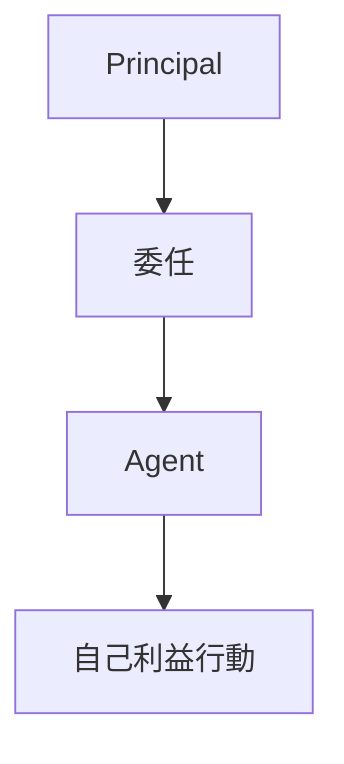

# モラルハザードパターン

代理関係において、AgentがPrincipalの利益より自己利益を優先する行動パターン。

---

# パターン構造

```mermaid
graph TD

A[Principal] --> B[委任]
B --> C[Agent]

C --> D[自己利益行動]
```

---

# 例

- 経営者の過剰報酬
- 官僚の予算拡張
- 保険の過剰利用