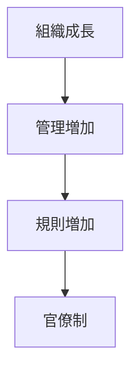

# 官僚化パターン

組織が成長するにつれて規則・手続き・階層が増加し、官僚制的運営へ移行するパターン。

---

# パターン構造

```mermaid
graph TD

A[組織成長] --> B[管理増加]
B --> C[規則増加]
C --> D[官僚制]
```

---

# 特徴

- 手続き増加
- 管理職増加
- 文書化

---

# 問題

- 意思決定遅延
- 柔軟性低下