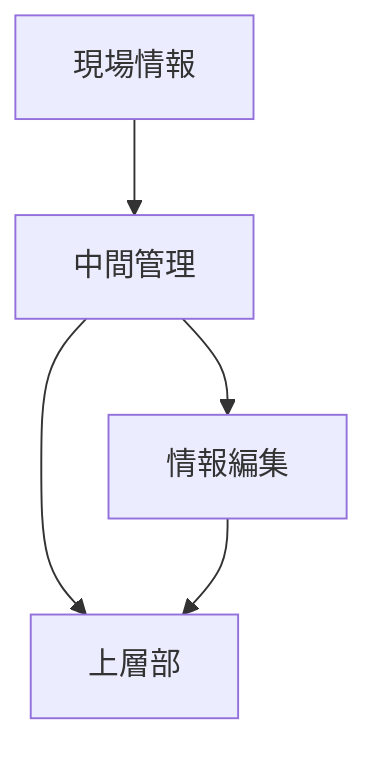

# 情報歪曲パターン

組織階層を通る過程で情報が変形・省略・操作されるパターン。

---

# パターン構造

```mermaid
graph TD

A[現場情報] --> B[中間管理]
B --> C[上層部]

B --> D[情報編集]
D --> C
```

---

# 原因

- 評価回避
- 責任回避
- 上意下達文化

---

# 結果

- 誤った意思決定
- 組織失敗