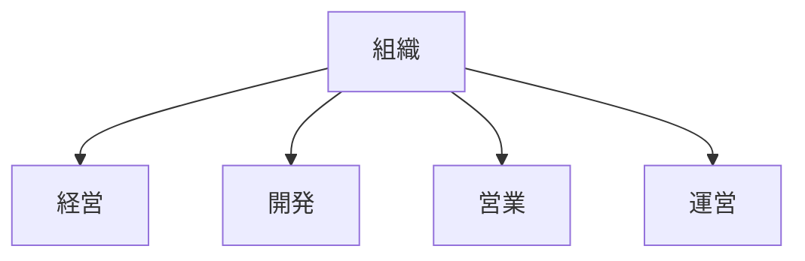

# 役割構造

役割構造とは、組織において各メンバーが担う機能や責任の分担構造である。

---

# 基本構造

---

# 役割の機能

- 分業
- 専門化
- 効率化

---

# 関連

[[02_zettelkasten/01_knowledge/world_model/meta/pattern/organization/structure/意思決定構造]]  
[[02_zettelkasten/01_knowledge/world_model/meta/pattern/organization/structure/情報構造]]