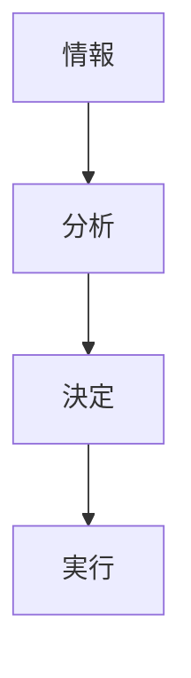

# 意思決定構造

意思決定構造とは、組織において意思決定がどのような手順と権限で行われるかの構造である。

---

# 基本構造

---

# 意思決定の型

- トップダウン
- ボトムアップ
- 合議

---

# 関連

[[02_zettelkasten/01_knowledge/world_model/meta/pattern/organization/structure/権力構造]]  
[[02_zettelkasten/01_knowledge/world_model/meta/pattern/organization/structure/情報構造]]