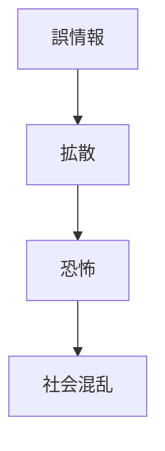

---

# デマパニック

note_type: case
layer: case
domain: social
status: draft
pattern:
 - 情報カスケードパターン
 - パニックパターン
structure:
 - 社会関係構造
---

# デマパニック

誤情報が社会に広がり、集団的恐怖を生む現象。

---

# 基本構造

```mermaid
graph TD
A[誤情報] --> B[拡散]
B --> C[恐怖]
C --> D[社会混乱]
```
