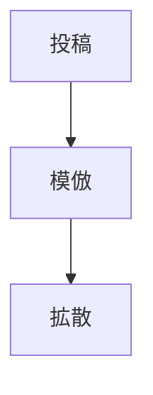

---

# ネットミーム

note_type: case
layer: case
domain: social
status: draft
pattern:
 - 情報カスケードパターン
structure:
 - 社会関係構造
---

# ネットミーム

ネット上で急速に拡散する文化的表現。

---

# 基本構造

```mermaid
graph TD
A[投稿] --> B[模倣]
B --> C[拡散]
```
