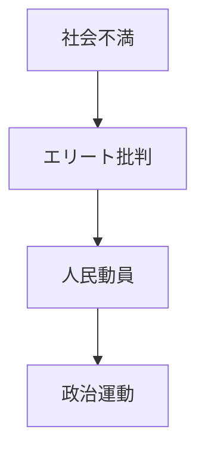

---

# ポピュリズム

note_type: case
layer: case
domain: social
status: draft
pattern:
 - 分極化パターン
 - スケープゴートパターン
structure:
 - 集団対立構造
---

# ポピュリズム

政治を「人民 vs エリート」という対立構図で動員する政治現象。

---

# 基本構造

# 特徴
- 単純化
- 強い動員力
- 分極化