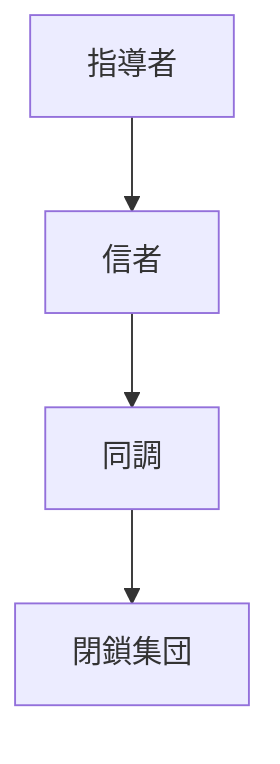

---

# 宗教カルト

note_type: case
layer: case
domain: social
status: draft
pattern:
 - 同調パターン
 - 権威依存パターン
structure:
 - 集団構造
---

# 宗教カルト

強い指導者と閉鎖的集団によって形成される高い統制を持つ宗教的共同体。

---

# 基本構造

# 特徴
- 強い権威
- 内集団意識
- 外部遮断