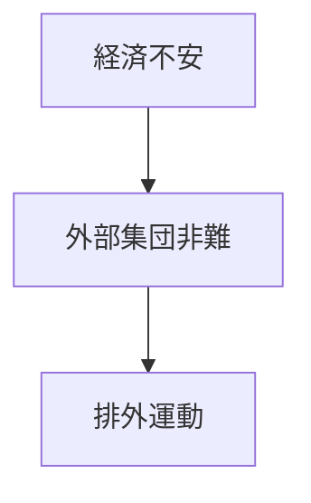

---

# 排外運動

note_type: case
layer: case
domain: social
status: draft
pattern:
 - 排除パターン
structure:
 - 集団対立構造
---

# 排外運動

外国人や外部集団を排除しようとする社会運動。

---

# 基本構造

```mermaid
graph TD
A[経済不安] --> B[外部集団非難]
B --> C[排外運動]
```
