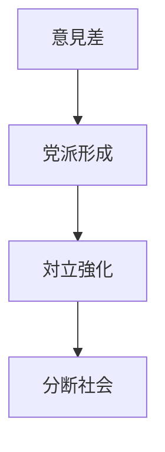

---

# 政治分断

note_type: case
layer: case
domain: social
status: draft
pattern:
 - 分極化パターン
structure:
 - 集団対立構造
---

# 政治分断

社会が政治的価値観によって深く二極化する現象。

---

# 基本構造

```mermaid
graph TD
A[意見差] --> B[党派形成]
B --> C[対立強化]
C --> D[分断社会]
```

# 特徴
- 対話困難
- 政治的不信