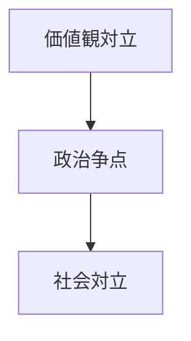

---

# 文化戦争

note_type: case
layer: case
domain: social
status: draft
pattern:
 - 分極化パターン
structure:
 - 集団対立構造
---

# 文化戦争

社会の価値観や文化を巡る長期的対立。

---

# 基本構造

```mermaid
graph TD
A[価値観対立] --> B[政治争点]
B --> C[社会対立]
```
