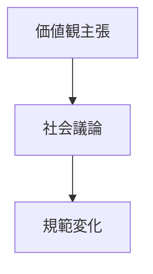

---

# 道徳運動

note_type: case
layer: case
domain: social
status: draft
pattern:
 - 規範形成パターン
structure:
 - 規範構造
---

# 道徳運動

社会の道徳規範を変えようとする社会運動。

---

# 基本構造

```mermaid
graph TD
A[価値観主張] --> B[社会議論]
B --> C[規範変化]
```
