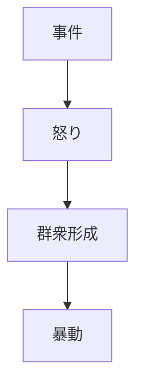

---

# 都市暴動

note_type: case
layer: case
domain: social
status: draft
pattern:
 - パニックパターン
structure:
 - 集団対立構造
---

# 都市暴動

都市で発生する大規模な群衆暴力。

---

# 基本構造

```mermaid
graph TD
A[事件] --> B[怒り]
B --> C[群衆形成]
C --> D[暴動]
```

# 特徴
- 群衆心理
- 急速拡大