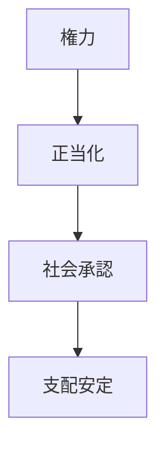

# 権力正当化パターン

権力が社会に受け入れられるため、  
正当性の根拠が形成される現象。

---

# 構造

```mermaid
graph TD

A[権力] --> B[正当化]
B --> C[社会承認]
C --> D[支配安定]
```

---

# 正当化の種類

## 伝統的正当性

伝統・慣習。

## カリスマ的正当性

個人の魅力。

## 法的正当性

法律や制度。

---

# 例

- 王権神授説
- 民主主義
- 官僚制度