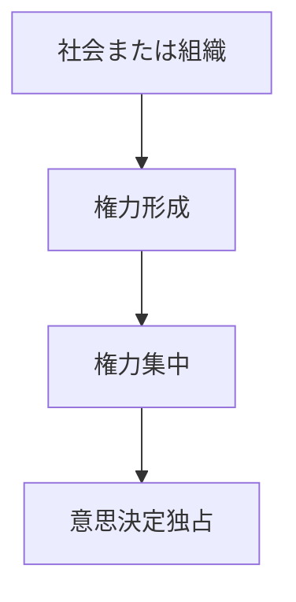

# 権力集中パターン

社会や組織において、意思決定権や資源が  
少数の主体に集中していく現象。

---

# 構造

```mermaid
graph TD

A[社会または組織] --> B[権力形成]
B --> C[権力集中]
C --> D[意思決定独占]
```

---

# 発生要因

## 効率性

意思決定の迅速化。

## 資源格差

資金・情報・組織力。

## 制度構造

中央集権制度。

---

# 例

- 国家権力
- 大企業経営
- プラットフォーム企業