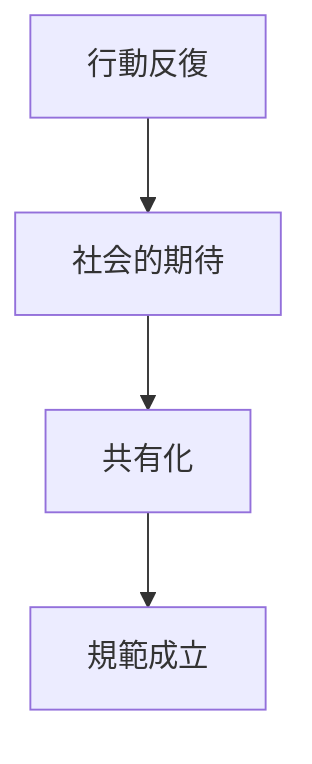

# 規範形成パターン

社会の中で、特定の行動様式や価値観が共有され、  
社会的規範として定着する現象。

---

# 構造

---

# 段階

## 1 行動発生

新しい行動が現れる。

## 2 模倣

他者が模倣する。

## 3 社会期待

「そうするべき」という期待が生まれる。

## 4 規範化

違反すると社会的制裁が発生する。

---

# 例

- 礼儀
- 社会マナー
- 職業倫理