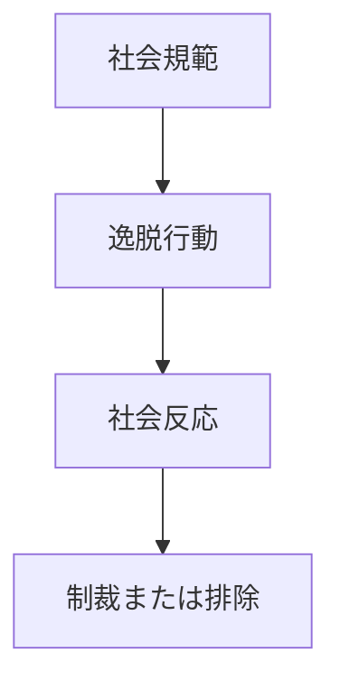

# 逸脱パターン

社会規範から外れた行動が発生し、  
社会から問題視される現象。

逸脱は単なる異常ではなく、  
**規範の存在によって生まれる社会現象**である。

---

# 構造

---

# 逸脱の発生要因

## 規範の多様性

社会には複数の規範が存在する。

## 社会的不平等

資源や機会の格差。

## 個人特性

価値観や性格。

---

# 社会反応

逸脱行動は社会によって

- 批判
- 制裁
- 排除

などの反応を受ける。

---

# 社会学的意味

逸脱は社会にとって

- 規範を確認する機能
- 社会境界を明確化する機能

を持つ。

---

# 例

- 犯罪
- 不道徳行為
- 社会規範違反

---

# 関連

規範形成パターン  
排除パターン  
モラルパニックパターン