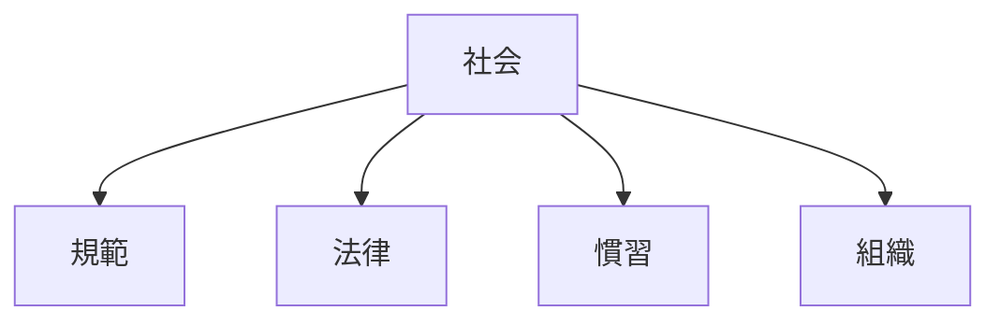

# 制度構造

制度構造とは、社会における行動ルールや役割を安定させる仕組み。

制度は社会行動を長期的に安定させる。

---

# 構造

```mermaid
graph TD

A[社会]

A --> B[規範]
A --> C[法律]
A --> D[慣習]
A --> E[組織]
```

---

# 制度の役割

- 行動予測可能性
- 社会秩序維持
- 協力促進

---

# 制度の例

- 家族制度
- 市場制度
- 教育制度
- 政治制度

---

# 関連

規範構造  
社会統合構造  
国家制度構造