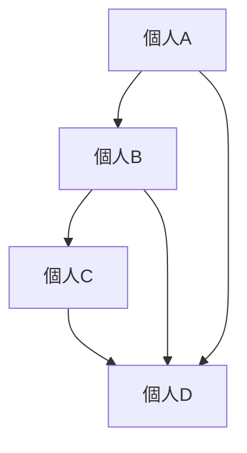

# 社会ネットワーク構造

社会ネットワーク構造とは、個人や集団が関係の網の目として接続される構造。

社会は孤立した個人の集合ではなく、  
**関係のネットワーク**として存在する。

---

# 構造

---

# ネットワークの要素

## ノード

個人・組織。

## リンク

関係。

## クラスター

密接な集団。

---

# 特徴

- 情報拡散経路
- 信頼形成
- 社会資本

---

# 例

- SNS
- 友人関係
- 企業ネットワーク

---

# 関連

社会関係構造  
流行拡散パターン  
情報カスケードパターン