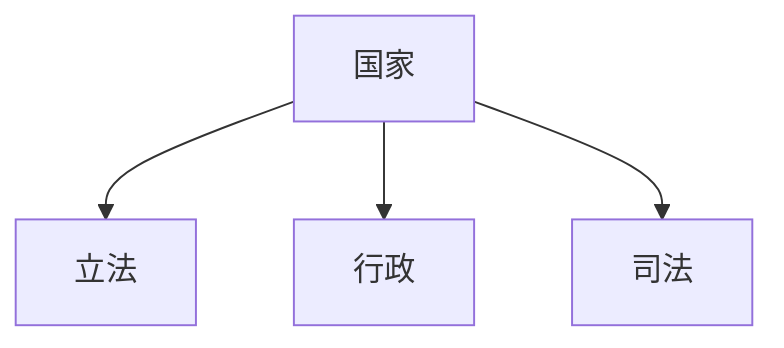

# 統治構造

統治構造とは、国家が社会を統治する制度的構造である。

---

# 基本構造

```mermaid
graph TD

A[国家]

A --> B[立法]
A --> C[行政]
A --> D[司法]
```

---

# 三権

## 立法

法律制定。

## 行政

政策実行。

## 司法

法の解釈。

---

# 関連

[[02_zettelkasten/未整理/model 1/world_model/03_social/institution/制度構造]]