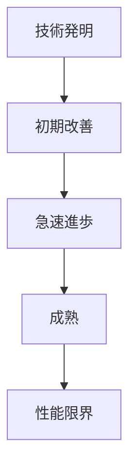
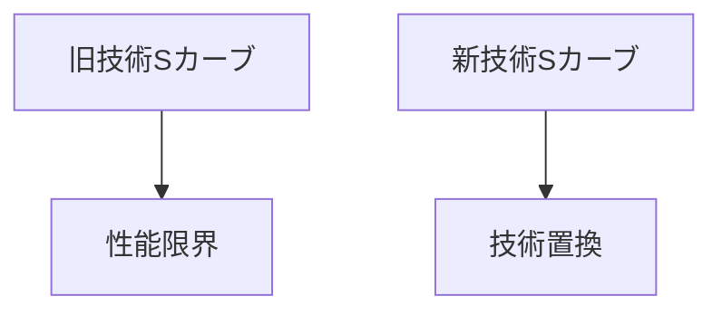

# 技術Sカーブパターン

技術の性能向上は一定ではなく、  
**初期は遅く → 急速に進歩 → 限界に達して停滞**  
というS字型の進化を示す。

この進化曲線を **技術Sカーブ** と呼ぶ。

---

# 構造

---

# Sカーブの段階

## 1 発明段階

- 新しい原理の発見
- 技術はまだ未成熟

## 2 改良段階

- 性能向上
- 応用拡大

## 3 成熟段階

- 改良余地減少
- 進歩速度低下

## 4 限界段階

- 技術限界
- 次の技術が出現

---

# 技術交替

Sカーブは単独ではなく  
**複数のカーブが交替する**

---

# 例

## 写真技術

- フィルム
- デジタルカメラ
- スマートフォン

## 記録媒体

- カセット
- CD
- ストリーミング

## 計算機

- 真空管
- トランジスタ
- 集積回路

---

# 特徴

- 初期は進歩が遅い
- 中期に急速発展
- 最後は限界に到達

---

# 関連

技術進化パターン  
技術破壊パターン  
技術置換パターン