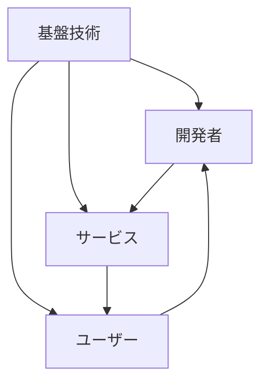

# 技術エコシステムパターン

特定の技術やプラットフォームを中心に、  
企業・開発者・サービスが相互依存関係を形成するパターン。

---

# 構造

```mermaid
graph TD

A[基盤技術]

A --> B[開発者]
A --> C[サービス]
A --> D[ユーザー]

B --> C
C --> D
D --> B
```

---

# 特徴

- 相互依存
- 技術ネットワーク
- プラットフォーム支配

---

# 例

- Appleエコシステム
- Androidエコシステム
- AWS