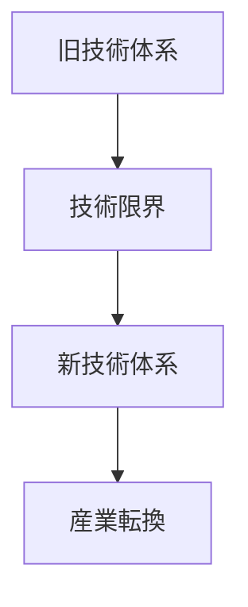

# 技術パラダイム転換パターン

新しい技術体系が旧来の技術体系を置き換え、  
産業や社会構造を根本的に変えるパターン。

---

# 構造

```mermaid
graph TD

A[旧技術体系] --> B[技術限界]
B --> C[新技術体系]
C --> D[産業転換]
```

---

# 例

- 蒸気機関 → 電気
- フィルム → デジタル
- PC → スマートフォン