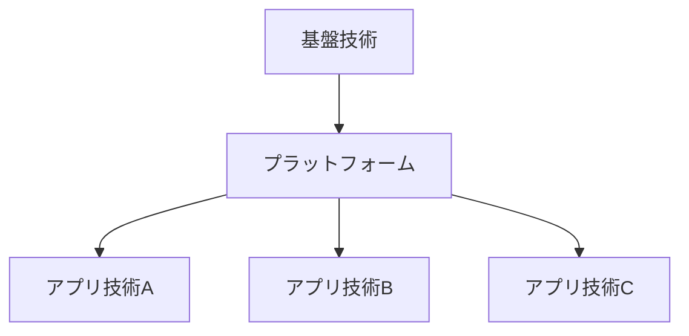

# 技術プラットフォームパターン

特定の技術基盤の上に多数の技術やサービスが構築される発展パターン。

---

# 構造

```mermaid
graph TD

A[基盤技術] --> B[プラットフォーム]

B --> C[アプリ技術A]
B --> D[アプリ技術B]
B --> E[アプリ技術C]
```

---

# 特徴

- 技術エコシステム形成
- 相互依存
- ネットワーク効果

---

# 例

- スマートフォンOS
- インターネット
- AIプラットフォーム