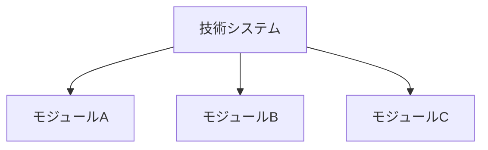

# 技術モジュール化パターン

複雑な技術システムが独立したモジュールに分解され、それぞれが独立して開発されるパターン。

---

# 構造

```mermaid
graph TD

A[技術システム]

A --> B[モジュールA]
A --> C[モジュールB]
A --> D[モジュールC]
```

---

# 特徴

- 開発分業
- 柔軟性
- 技術交換可能

---

# 例

- PCアーキテクチャ
- ソフトウェアAPI