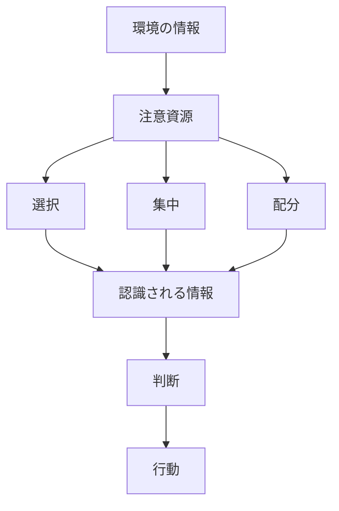
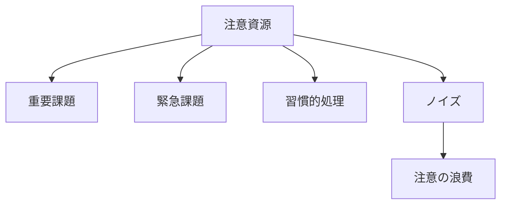
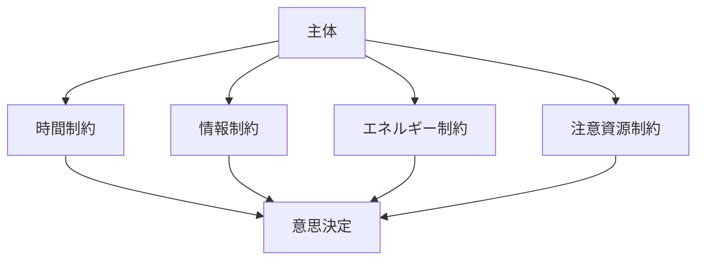

# 注意資源制約（Attention Constraint）

注意資源制約とは、主体が同時に処理できる情報量・対象数・課題数には限界があるという普遍的制約である。
注意は有限の資源であり、  すべての情報に同時に注意を向けることはできない。

そのため主体は、
- 注意の選択
- 注意の集中
- 注意の配分
を行う必要がある。

---

# 基本構造

---
# 制約の特徴

## 1 同時処理数の制限

人間は同時に多数の対象を処理できない。

例
- 会話しながら複雑な思考は難しい    
- 多数の情報を同時に理解できない    

---

## 2 注意の偏り

注意は以下に引き寄せられる。
- 強い刺激    
- 新規性    
- 危険    
- 感情    
- 社会的意味    

その結果、重要情報が無視されることがある。

---

## 3 注意疲労

注意は消耗する資源である。

長時間の注意集中は、
- 判断力低下    
- ミス増加    
- 情報処理能力低下    
を引き起こす。

---

# 注意資源の配分構造

---
# 注意資源制約が生む現象

この制約により以下が発生する。
- 認知バイアス    
- 限定合理性    
- ミス    
- 見落とし    
- ルーチン化    

---

# 社会システムへの影響

注意資源制約は、社会制度や組織設計にも影響する

例
- ダッシュボード    
- KPI    
- アラートシステム    
- 優先順位管理    

これらはすべて、注意資源の節約装置である。

---

# Kernelとしての位置

注意資源制約は、情報処理主体に共通する基本制約であり、次のKernelと並ぶ。

- [[02_zettelkasten/01_knowledge/world_model/model/social/constraints/情報制約]]    
- [[02_zettelkasten/01_knowledge/world_model/model/social/constraints/時間制約]]    
- [[02_zettelkasten/01_knowledge/world_model/model/social/constraints/不確実性制約]]

---
# 要点

注意資源制約とは、主体が同時に処理できる対象には限界があるという普遍的制約である。

そのため、
- 注意の選択    
- 優先順位    
- 情報整理    
がすべての行動・組織・制度の基礎となる。