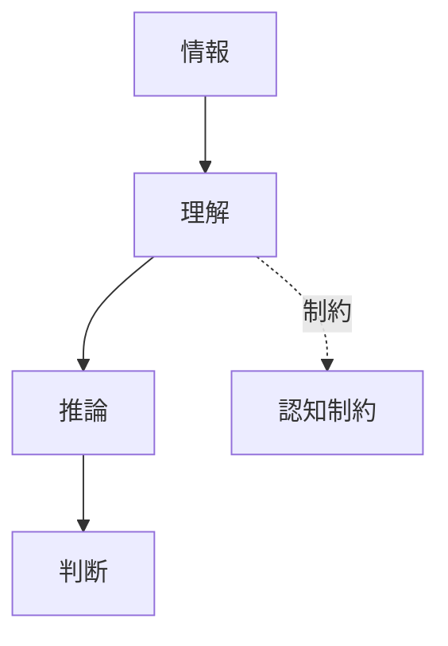

---

# 認知制約

```markdown
---
note_type: kernel
layer: kernel
kernel_type: constraint
related:
  - [[限定合理性]]
---

# 認知制約（Cognitive Constraint）

主体の理解・計算能力には限界があるという制約。

---

# 構造



---

# 結果

- [[02_zettelkasten/01_knowledge/world_model/model/social/information/認知バイアス|認知バイアス]]
- 簡略化判断

