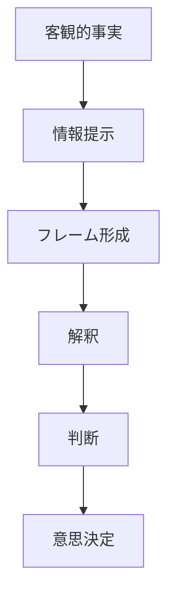

# フレーミングパターン

同じ事実であっても、提示の仕方（フレーム）が変わると人間の判断や意思決定は大きく変化する。

この現象を **フレーミングパターン** と呼ぶ。

---

# パターン構造

---

# 説明

人間は情報を完全に処理できないため、

- 情報の選択
- 表現
- 強調
- 比較基準

によって解釈が変わる。

つまり

**判断は事実そのものではなく、提示の仕方に影響される。**

---

# 典型的フレーム

## 損失フレーム

例

- 「死亡率10%」
- 「失敗の可能性」

人は損失に強く反応する。

---

## 利得フレーム

例

- 「成功率90%」
- 「利益が得られる」

同じ内容でも判断が変わる。

---

## 責任フレーム

例

- 個人責任
- 社会責任

問題の原因認識が変わる。

---

## 敵味方フレーム

例

- 我々 vs 彼ら
- 正義 vs 悪

政治・戦争・SNS論争で頻出。

---

# 社会での例

政治

- 税負担 vs 社会保障

メディア

- 犯罪者の属性強調

ビジネス

- 割引表示
- 商品価値の見せ方

---

# 特徴

フレーミングは

- 注意の焦点を変える
- 解釈を誘導する
- 意思決定を操作する

という効果を持つ。

---

# 関連

Structure  
[[フレーミング構造]]

Kernel  

[[02_zettelkasten/01_knowledge/world_model/academic/principles/限定合理性]]  
[[02_zettelkasten/01_knowledge/world_model/academic/principles/注意資源制約]]  
[[認知節約原理]]

関連Pattern  

[[02_zettelkasten/01_knowledge/world_model/pattern/cognition/自己正当化パターン]]  
[[02_zettelkasten/01_knowledge/world_model/pattern/cognition/社会的同調パターン]]

Case  

[[政治プロパガンダ]]  
[[広告表現]]