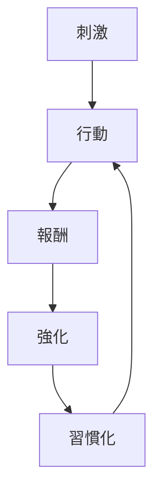

# 習慣形成パターン

人間の行動は、繰り返し行われることで自動化され、意識的な意思決定を経ずに再生されるようになる。

この現象は **習慣ループ** によって説明される。

---

# パターン構造

---

# 説明

習慣形成は次の循環で起きる。

1 刺激  
環境や状況が行動を誘発する

2 行動  
人がある行動を実行する

3 報酬  
快・達成・安心などの報酬が得られる

4 強化  
脳がその行動を有効と認識する

5 習慣化  
行動が自動化される

---

# 特徴

習慣には次の特徴がある。

- 意志力を消費しない  
- 繰り返しで強化される  
- 環境に強く依存する  
- 意識より先に発動する

---

# よく見られる例

日常生活

- 朝コーヒーを飲む  
- スマホを無意識に見る  
- 歯磨き

仕事

- 毎朝メール確認  
- ルーチン作業

悪習慣

- SNS依存  
- 間食  
- 先延ばし

---

# 関連

Structure  
[[02_zettelkasten/01_knowledge/world_model/model/human/learning/習慣ループ]]

Kernel  
[[02_zettelkasten/01_knowledge/world_model/model/human/human/習慣形成原理]]  
[[02_zettelkasten/01_knowledge/world_model/model/human/learning/行動強化]]

関連Pattern  
[[02_zettelkasten/01_knowledge/world_model/pattern/cognition/動機強化パターン]]

Case  
[[SNS依存]]