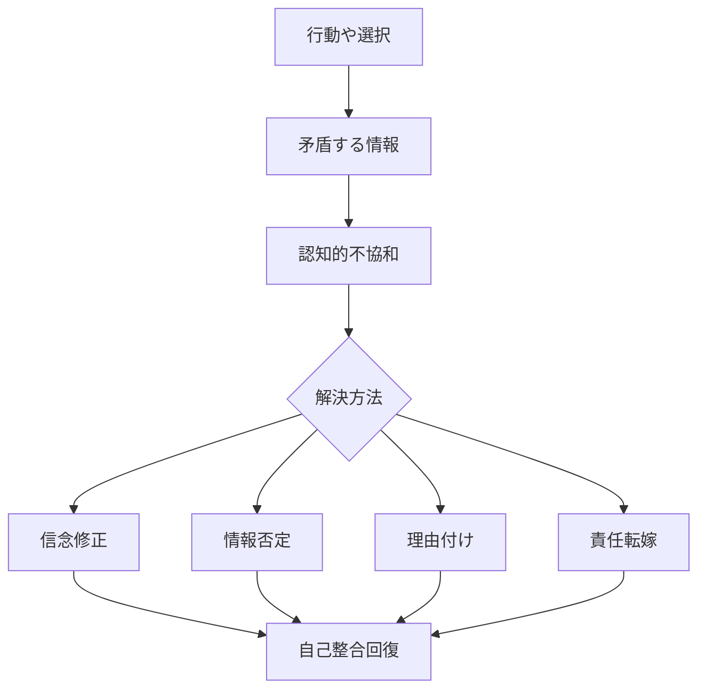

# 自己正当化パターン

人間は、自分の行動・信念・選択が誤っていた可能性を認めるよりも、それを正当化する方向に認知を調整する傾向がある。

この現象を **自己正当化パターン** と呼ぶ。

---

# パターン構造

---

# 説明

人は自分の行動と信念が矛盾すると **心理的不快（認知的不協和）** を感じる。

そのため人は次のいずれかで整合性を回復する。

- 信念を変える
- 情報を否定する
- 行動を合理化する
- 他者に責任を転嫁する

多くの場合、人は **信念を変えるより合理化を選ぶ。**

---

# 典型パターン

## 合理化

例

- 「本当は価値がないから落ちた」
- 「あの大学は行く価値がない」

## 情報否定

例

- 「その研究は信用できない」
- 「マスコミは嘘をついている」

## 責任転嫁

例

- 上司が悪い  
- 社会が悪い  
- 制度が悪い

---

# 社会での例

政治

- 支持政党の失敗を認めない

経済

- 投資の失敗を市場のせいにする

宗教

- 予言が外れても信仰が強化される

---

# 特徴

自己正当化は

- アイデンティティを守る
- 社会的地位を守る
- 自尊心を守る

という機能を持つ。

そのため

**強い信念ほど修正されにくい。**

---

# 関連

Structure  
[[認知的不協和構造]]

Kernel  
[[自己保存原理]]  
[[02_zettelkasten/01_knowledge/world_model/model/human/human/アイデンティティ形成原理]]

関連Pattern  

[[02_zettelkasten/01_knowledge/world_model/pattern/cognition/アイデンティティ防衛パターン]]  
[[02_zettelkasten/01_knowledge/world_model/pattern/cognition/社会的同調パターン]]

Case  

[[宗教的予言の失敗]]  
[[投資バイアス]]