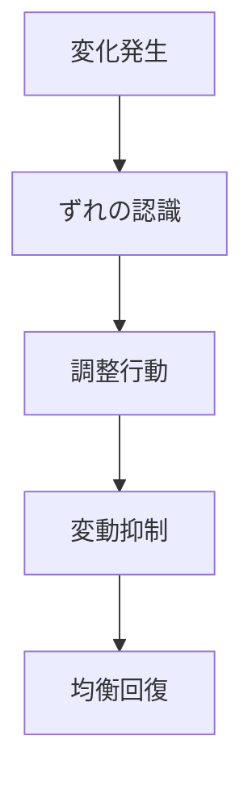

# 安定化パターン

システムが変動を受けても、負のフィードバックや調整機構によって均衡に戻ろうとするダイナミクスを **安定化パターン** と呼ぶ。

---

# パターン構造

---

# 説明

システムには、変化をそのまま拡大させるものもあれば、変化を打ち消して元の状態へ戻そうとするものもある。

安定化は後者であり、

- 需給調整
- 温度調整
- 組織統制
- 制度修正

のような仕組みで成立する。

---

# 典型的局面

## 逸脱発生

均衡からずれが起きる。

## 検知

ずれが認識される。

## 調整

反対方向の力が作用する。

## 回復

元のレンジへ収束する。

---

# 社会での例

- 価格調整
- 在庫調整
- 行政による介入
- 生体恒常性

---

# 特徴

安定化は

- 負のフィードバックに支えられる
- 変動を吸収する
- 過剰調整すると振動を生むことがある

---

# 関連

Structure  
[[均衡構造]]

Pattern  
[[02_zettelkasten/01_knowledge/world_model/pattern/dynamics/mechanism/フィードバックパターン]]  
[[02_zettelkasten/01_knowledge/world_model/pattern/dynamics/mechanism/適応パターン]]  
[[02_zettelkasten/01_knowledge/world_model/pattern/dynamics/behavior/振動パターン]]

Case  
[[市場均衡]]