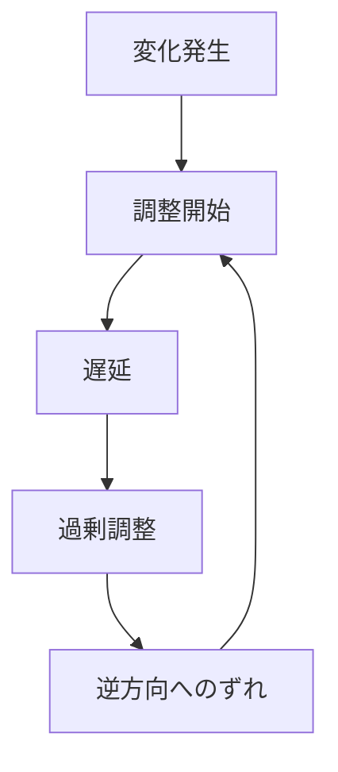

# 振動パターン

システムが均衡へ戻ろうとする過程で、調整の遅れや過剰反応によって上下動を繰り返すダイナミクスを **振動パターン** と呼ぶ。

---

# パターン構造

---

# 説明

振動は、安定化を目指す調整が即時には効かず、時間遅延や過剰反応によって「行き過ぎ」と「戻しすぎ」を繰り返すときに生じる。

そのため振動は

- 制御の難しさ
- 情報の遅れ
- 調整の粗さ

を示す。

---

# 典型的局面

## 変動

均衡からずれる。

## 調整

均衡へ戻そうとする。

## 遅延

結果がすぐには現れない。

## 行き過ぎ

戻しすぎる。

## 反転

逆方向へ過剰修正する。

---

# 社会での例

- 景気循環
- 在庫循環
- 政策の後追い調整
- 組織の過剰締め付けと緩和

---

# 特徴

振動は

- 遅延と調整の組み合わせで起きる
- 安定化機構が弱いか粗いと強まる
- 長期化すると疲弊や崩壊に接続することがある

---

# 関連

Structure  
[[時間遅延構造]]

Pattern  
[[02_zettelkasten/01_knowledge/world_model/pattern/dynamics/mechanism/遅延パターン]]  
[[02_zettelkasten/01_knowledge/world_model/pattern/dynamics/behavior/安定化パターン]]  
[[02_zettelkasten/01_knowledge/world_model/pattern/dynamics/mechanism/フィードバックパターン]]

Case  
[[景気循環]]