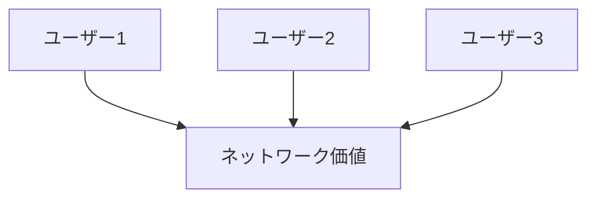

# ネットワーク市場構造

ネットワーク市場とは、利用者が増えるほど価値が高まる財やサービスによって形成される市場構造である。

---

# 基本構造

---

# ネットワーク効果

## 直接効果

ユーザー数が増えるほど価値が上がる。

例  
SNS  
メッセージアプリ

## 間接効果

関連サービスが増える。

例  
アプリ市場  
プラットフォーム

---

# 特徴

- 勝者総取りになりやすい
- 参入障壁が高くなる
- ロックインが起きやすい

---

# 関連

Structure  
[[02_zettelkasten/01_knowledge/world_model/pattern/market/structure/参入障壁構造]]

Pattern  
[[02_zettelkasten/01_knowledge/world_model/pattern/market/pattern/勝者総取りパターン]]  
[[02_zettelkasten/01_knowledge/world_model/pattern/market/pattern/市場ロックインパターン]]