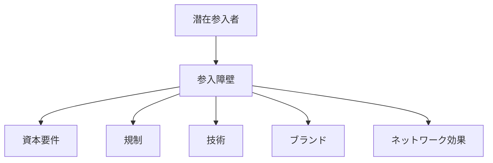

# 参入障壁構造

参入障壁とは、新しい企業が市場に参入することを困難にする要因の構造である。

参入障壁が高いほど市場は既存企業に有利となり、競争は弱まりやすい。

---

# 基本構造

---

# 主な参入障壁

## 資本障壁

設備投資や資金の必要性。

## 技術障壁

専門技術やノウハウ。

## 規制障壁

許認可や制度。

## ブランド障壁

信頼や知名度。

## ネットワーク効果

既存ユーザーの多さ。

---

# 関連

Structure  
[[02_zettelkasten/01_knowledge/world_model/pattern/market/dynamics/競争構造]]  
[[02_zettelkasten/未整理/model 1/world_model/03_social/competition/寡占構造]]

Pattern  
[[02_zettelkasten/01_knowledge/world_model/pattern/market/pattern/市場ロックインパターン]]  
[[02_zettelkasten/01_knowledge/world_model/pattern/market/pattern/寡占形成パターン]]